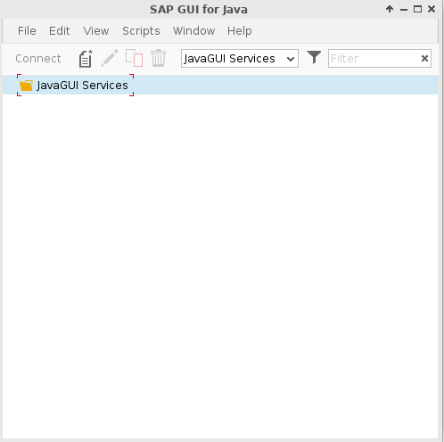
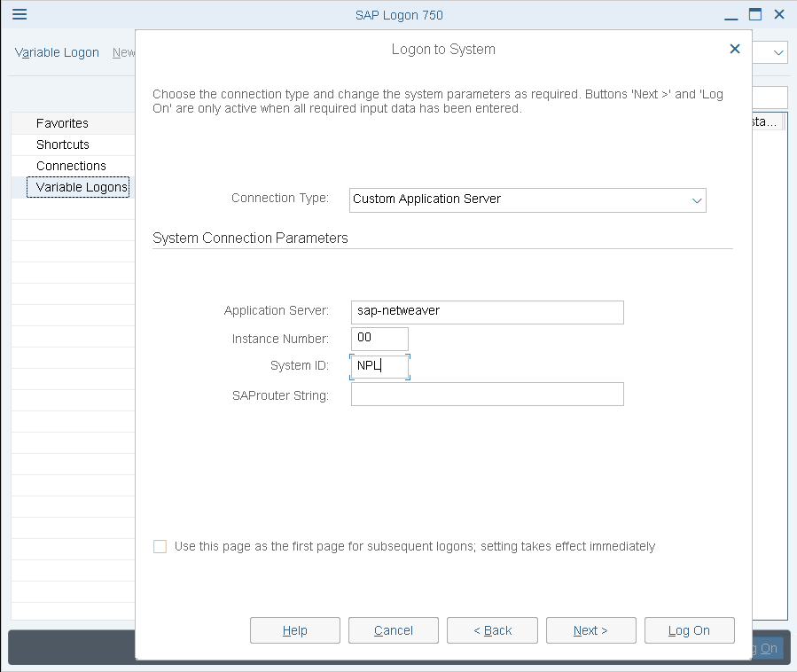
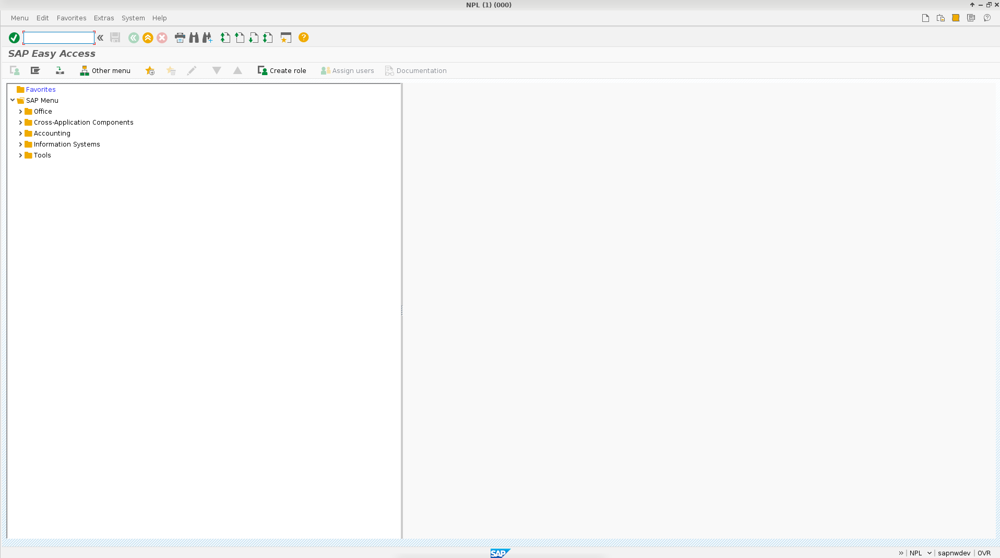
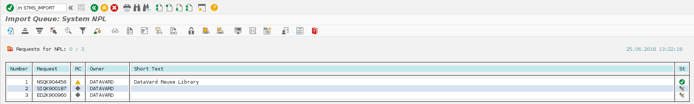
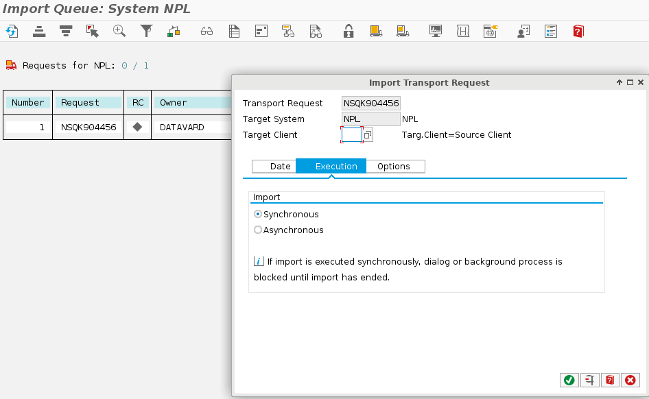
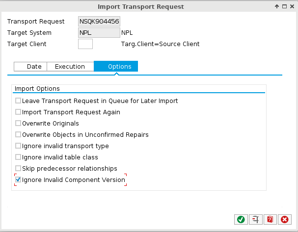

SE Lab for AppDynamics - SAP ABAP
======
# 1. General Information
**This Lab will cover:**
* SAP APM

# 2. Lab Setup
## 2.1. Create your environment
* Log into [Ravello] (appdynamicsravello)
* Create an App from the Blueprint `sap-netweaver-dev-bp` (20 minutes till everything is up)
* Download and Install SAP GUI (click through Install)
  * [Windows]
  * [Linux]
  * [Mac]

## 2.2. Accessing the Lab
* SSH Login
  * Download [SSH Key]
  * `chmod 600 devops_level1_lab.pem`
  * `ssh -i devops_level1_lab.pem ubuntu@<Ravello VM Host/IP>`
* Check the Startup status
  * `docker logs -f sap`
  * SAP is up when you see

```
starting SAP Instance D00
Startup-Log is written to /home/npladm/startsap_D00.log
-------------------------------------------
/usr/sap/NPL/D00/exe/sapcontrol -prot NI_HTTP -nr 00 -function Start
Instance on host sapnwdev started
```

* Accessing the AppDynamics UIs
  * Controller
    * `http://<Ravello VM Host/IP>:8090`
    * User: `admin`
    * Password: `appdynamics`
  * Enterprise Console
    * `http://<Ravello VM Host/IP>:9191`
    * User: `admin`
    * Password: `appdynamics`
* Open SAP GUI



* Create New Connection
  * Go To the `Advanced Tab`
  * Check `Expert Mode`
  * Put in your Connection Details like
    * `conn=/H/<Ravello VM Host/IP>/S/3200&wan=true&clnt=000&user=SAP*`
  * Save



* Connect
  * User: `SAP*`
  * Password: `Appl1ance`



# 3. Install SAP ABAP Agent
* General Setup is documented within [Install SAP Netweaver Systems]

## 3.1. Install the SAP ABAP Components
* Go to the Transports
  * `cd /home/ubuntu/abap_transports`
* Copy the Transports into the SAP transport folders
  * `docker cp cofiles/K900187.SIQ sap:/usr/sap/trans/cofiles/`
  * `docker cp cofiles/K900960.ED2 sap:/usr/sap/trans/cofiles/`
  * `docker cp cofiles/K904456.NSQ sap:/usr/sap/trans/cofiles/`
  * `docker cp data/R904456.NSQ sap:/usr/sap/trans/data/`
  * `docker cp data/R900187.SIQ sap:/usr/sap/trans/data/`
  * `docker cp data/R900960.ED2 sap:/usr/sap/trans/data/`
* Open the SAP GUI and go to the `/n STMS_IMPORT` Transaction

* The list will still be empty. Now queue the requests by
  * Click `Extras -> Other Requests -> Add`
  * This has to be done for all 3 Transports
* Import the Transport request **in the order shown above** by `Right click -> Import`
* Check `Synchronous` within `Execution`

* Check `Ignore invalid Component Version` within `Options`

* Save and confirm for each of the Requests. This will take some time. **Go ahead and do 3.2. and 3.3. in parallel**
* **Ignore if you see Errors on the last Transport**

## 3.2. Install the AppDynamics C++ SDK and HTTP SDK Proxy
* The Agent Bits are available within the Docker Image `appd-sap-agent`
  * Check [AppD SAP Agent] for details
* Get in the Container
  * `docker exec -ti appd-sap-agent /bin/bash`
* Start the SDK Manager
  * `/opt/appdynamics/appdhttpsdk/runSDKManager`

## 3.3. Install the Machine Agent
* We will install the Machine Agent within the SAP Container
* Unzip the Machine Agent
  * `unzip /home/ubuntu/machineagent.zip -d /home/ubuntu/machineagent`
* Configure the Machine Agent
  * `vi /home/ubuntu/machineagent/conf/controller-info.xml`
  * controller-host is `172.17.0.1`
  * controller-port is `8090`
  * account-access-key is `appdynamics`
  * account-name is `customer1`
  * sim-enabled is `true`
* Copy it into the Container
  * `docker cp /home/ubuntu/machineagent/ sap:/opt/machineagent`
* Start the Machine Agent
  * `docker exec -d sap /bin/bash -c "/opt/machineagent/bin/machine-agent -d -p machine.pid -Dmetric.http.listener=true -Dmetric.http.listener.port=8293 -Dmetric.http.listener.host=0.0.0.0"`

# 4. Configure SAP ABAP Agent
* Open the SAP GUI and go to the `/n /DVD/APPD_CUST` Transaction
* Fill out all the required Information
  * The SDK is remote
  * The Machine Agent is local
  * To connect to the Events Service we need an API Key
* On the Status Screen you should see everything as green in the end

# Troubleshooting
* The AppDynamics platform does not come up
  * Delete the old one `docker rm -f appd`
  * Create a new one `docker run -d --restart always --name appd --hostname 3ead5cb9db00 -p 8090:8090 -p 9191:9191 -p 9080:9080 michaelenglert/appd-platform`
  * Copy in the license `docker cp /home/ubuntu/license.lic appd:/opt/appdynamics/platform/controller/`

[AppD SAP Agent]: /docker/Dockerfile
[Install SAP Netweaver Systems]: https://docs.appdynamics.com/display/SAP/Install+SAP+Netweaver+Systems
[ravello]: https://cloud.ravellosystems.com/
[SSH Key]: https://singularity.jira.com/wiki/download/attachments/353600935/devops_level1_lab.pem?version=1&modificationDate=1517075637133&cacheVersion=1&api=v2&download=true
[Windows]: https://owncloud.appd.duckdns.org/s/GoR9z54GGgpQw9C
[Linux]: https://owncloud.appd.duckdns.org/s/BtF79RGWD3ca9pR
[Mac]: https://owncloud.appd.duckdns.org/s/894rw9QxDn9QJqX
